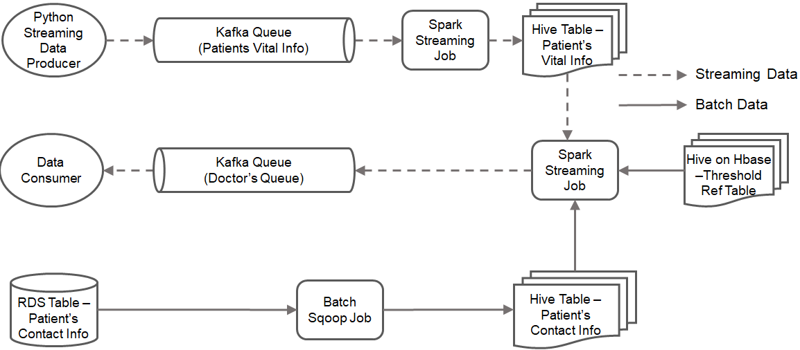

# Healthcare Monitoring Data Pipeline

<p align="center">
  <br/>
  <i>Pipeline</i>
</p>

## Project Description

Healthcare monitoring at hospitals has become increasingly challenging due to the surge in IoT devices used for patient monitoring. This project proposes a reliable data pipeline to collect, store, and analyze real-time data streams from hospital IoT devices. The pipeline is designed to process and analyze patient vital signs like heart rate and blood pressure in real-time, ensuring timely alert notifications when anomalies are detected.

The project focuses on implementing a streaming data pipeline using Apache Kafka, Apache Spark, Hive, HBase, and Amazon SNS. The system integrates multiple data sources, including real-time patient vitals, batch patient contact data, and predefined threshold values, to determine whether alerts need to be generated for potential health risks.

## Datasets

### 1. Patient's Vital Information Dataset

This dataset represents real-time streaming data collected from IoT devices monitoring patient vitals.

- **Schema:**
    - `patient_id` (INT)
    - `heart_rate` (INT)
    - `bp` (INT)
    - `timestamp` (TIMESTAMP)
- **Example Record:**
    
    ```
    {"heart_rate": 73, "bp": 140, "patient_id": 2, "timestamp": "2025-03-12T05:52:01.885Z"}
    ```
    

### 2. Patient's Contact Information Dataset

This dataset stores batch data about patient contact details.

- **Schema:**
    - `patient_id` (INT)
    - `patient_name` (STRING)
    - `patient_address` (STRING)
    - `phone_number` (STRING)
    - `admitted_ward` (INT)
    - `age` (INT)
    - `other_details` (STRING)
- **Example Record:**
    
    
    | patient_id | patient_name | patient_address | phone_number | admitted_ward | age | other_details |
    | --- | --- | --- | --- | --- | --- | --- |
    | 1 | Alex S | XDC Test Address | 8982739282 | 1 | 23 | NULL |

### 3. Threshold Reference Table

This dataset contains reference threshold values for patient vitals based on age group.

- **Schema:**
    - `low_age_limit` (INT)
    - `high_age_limit` (INT)
    - `min_heart_rate` (INT)
    - `max_heart_rate` (INT)
    - `min_bp` (INT)
    - `max_bp` (INT)

## Solution Approach

### 1. **Streaming Data Ingestion**

- A **Python-based producer application** simulates IoT devices and pushes patient vital information into an Apache Kafka topic.
- Kafka Queue (`patients_vital_info`) stores and streams the data to downstream systems.

### 2. **Batch Data Processing**

- Patient contact information is stored in an **RDS database**.
- **Apache Sqoop** is used to extract patient contact data from RDS and load it into Hive tables for querying.

### 3. **Data Storage and Transformation**

- A **Spark Streaming Job** reads the Kafka queue (`patients_vital_info`) and writes the data into a Hive table in **Parquet format**.
- The **Threshold Reference Table** is stored in **Hive on HBase**, providing easy access for queries.

### 4. **Anomaly Detection and Alert Generation**

- A **second Spark Streaming Job** monitors patient vital data and compares it against threshold values.
- If a patient's vitals exceed predefined safe limits, an **alert is generated**.
- The patient's contact information is retrieved from Hive.

### 5. **Notification System**

- The alert message, including the patient’s vital information and contact details, is formatted in **JSON**.
- A **Kafka Queue (`doctors_queue`)** is used to push alerts.
- A **consumer application** retrieves messages from `doctors_queue` and sends real-time alerts via **Amazon SNS (Simple Notification Service)**.

### 6. **Output Format (Sample Alert Notification)**

```
{
  "patient_name": "Sammy A",
  "age": 45,
  "patient_address": "New Building Address",
  "phone_number": "2382739282",
  "admitted_ward": 2,
  "bp": 140,
  "heart_rate": 73,
  "input_message_time": "2025-03-12T05:52:01.885Z",
  "alert_generated_time": "2025-03-12T07:00:20.942Z",
  "alert_message": "Low BP than Normal"
}
```

## Technologies Used

- **Apache Kafka** - Real-time data ingestion and message queuing
- **Apache Spark Streaming** - Real-time data processing and analysis
- **Apache Hive** - Data storage and querying
- **Apache HBase** - Storing threshold reference data
- **Apache Sqoop** - Batch data ingestion from RDS
- **Amazon SNS** - Sending alert notifications
- **Python** - Implementing Kafka producer and consumer applications

## Summary

This project demonstrates a **real-time healthcare monitoring system** that processes patient vitals, compares them with threshold values, and sends alerts when anomalies are detected. The solution leverages **big data technologies** to build a scalable and efficient data pipeline, ensuring timely notifications for critical health conditions.
